# Manual Keycloak provisioning

## Intruction

As described in [Overview](../users-tenants/overview#the-auth-layer) and [The Identity backend](../users-tenants/the-identity-backend), Keycloak is used as a ready-to-go third party dependency for performing all user- and session-related actions. It provides a built-in user management as well as the ability to connect to other IdPs using different protocols (OAuth2, LDAP, ...).

:::success

This document describes the required setup so that the [The Identity backend](../users-tenants/the-identity-backend), and therefore the entire Shopfloor application landscape, can communicate with Keycloak for managing purposes.

:::


## Prerequisites

Only a running Keycloack instance is required.

## Creating a client "app" for the `identity-backend`

__Step 1: Creating a realm__ 

Via the realm option at the top left corner a new realm can be created. This step is not strictly necessary but recommended. If you however choose to use the `Master` realm, be aware that you use this realm name in the following insted of the here proposes `Shoopfloor` realm name.

<div className="small-image-wrapper">


</div>

Create the realm with the following name (`Shopfloor`):

<div className="small-image-wrapper">

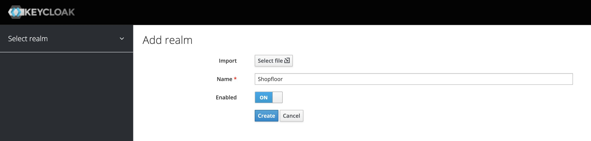

</div>

__Step 2: Creating a new client for the `identity-backend`__ 

Next a client is required for the `identity-backend`. This client is the main access way used by the `identity-backend` to

 - create, modify or delete users
 - create, modify or delete tenants
 - handle roles for users

Please ensure that the newly created realm `Shopfloor` is selected and displayed at the top left corner. All following actions should be performed inside this realm.

Select the menu option "Clients" in the left sidebar menu. You get a list of all registered and known clients. Click on the button `Create` to continue.

<div className="small-image-wrapper">

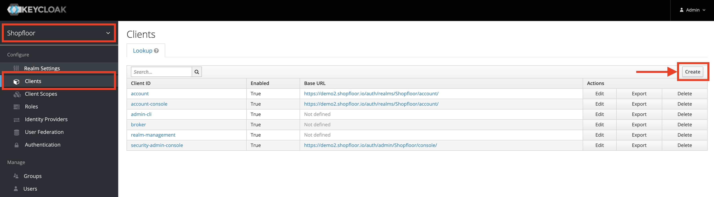

</div>

__Step 2a: Creating the client__ 

To add the new client select the following options:

 - `Client ID`: `identity-backend`
 - `Client Protocol`: `openid-connect`
 - `Root URL`: _(empty)_

<div className="small-image-wrapper">

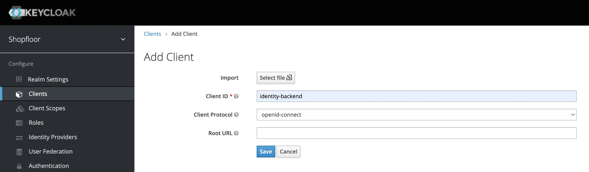

</div>

__Step 2b: Adjusting the settings__ 

You're now inside the newly created client. Please select the tab "Settings" and set the following options:

 - `Access Type`: `confidential`
 - `Service Accounts Enabled`: `ON`
 - `Valid Redirect URIs`: since its mandatory insert a valid base url followed by * e.g. `https://demo2.shopfloor.io/*`

Finish your changes by clicking the button `Save`.

__Step 2c: Getting the credentials for the `identity-backend`__

After saving the last step, a new tab appeared at the top, named "Credentials". Navigate to this tab.

<div className="small-image-wrapper">

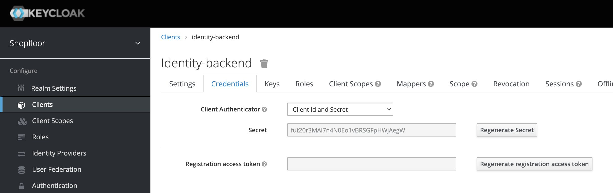

</div>

Please note down the secret since this secret is needed for the `identity-backend` to be able to connect to Keycloak. In the shown example, the secret is `fut20r3MAi7n4N0Eo1vBRSGFpHWjAegW` and the client id is `identity-backend` (without upper letter at the beginning). The `identity-backend` then expects the following environment variables:

    APP_KEYCLOAK_BASE_URL=https://the-keycloak-subdomain-if-any.your-tld/auth
    APP_KEYCLOAK_CLIENT_ID=identity-backend
    APP_KEYCLOAK_CLIENT_SECRET=fut20r3MAi7n4N0Eo1vBRSGFpHWjAegW
    APP_KEYCLOAK_REALM_NAME=Shopfloor

:::warning

Please note the uppercase `S` for the value of `APP_KEYCLOAK_REALM_NAME`. This is an important point since we created the realm with an uppercase letter so we need to supply here the exact same realm name including the casing. If for example a lowercase letter is provided the `identity-backend` will fail to connect.

:::

__Step 2d: Assigning the permissions for admin access to Keycloak__

Now the `identity-backend` is able to connect to Keycloack. The missing link is now that the created client (application) needs to be allowed to have access to the "administrative" functionality of Keycloak for creating, deleting and changing objects like users, groups and roles.

For this navigate to the tab "Service Account Roles":

<div className="small-image-wrapper">

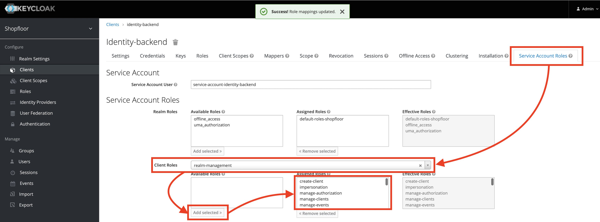

</div>

Select under __Client Roles__ the role `realm-management` and add all available roles (left) using the button "Add selected" to the assigned list. This delegates all permissions to the client used by the identity-backend for access.

The green status message (middle top of page) indicates that the changes have been successfully saved.

__Step 3: Successfully first connection after deployment of the `identity-backend`__

Now the `identity-backend` can be deployed with the mentioned environment variables. If everything works out, e.g. a default `tenants-all` group is created:

<div className="small-image-wrapper">

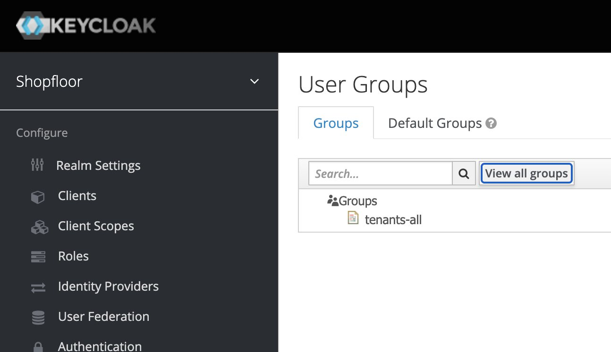

</div>

Besides this roles and rights are automatically created. The log output from the `identity-backend` looks like the following:


    ...
    [Nest] 39113   - 06.04.2022, 16:23:20   [RoutesResolver] StatusController {/v1}: +1ms
    [Nest] 39113   - 06.04.2022, 16:23:20   [RouterExplorer] Mapped {/v1/status, GET} route +0ms
    [Nest] 39113   - 06.04.2022, 16:23:20   [RouterExplorer] Mapped {/v1/v1/status, GET} route +0ms
    2022-04-06T14:23:20.330Z DEBUG [app:RolesService] Initializing service ...
    2022-04-06T14:23:20.331Z DEBUG [app:RolesService] Executing migration ...
    2022-04-06T14:23:20.331Z DEBUG [app:KeycloakRolesService] getAllRoles(): tenantId=null
    2022-04-06T14:23:20.331Z DEBUG [app:KeycloakRolesService] listRolesByPrefixCached(): urn:sio:role: -> ROLES_PREFIX__URN-SIO-ROLE-
    2022-04-06T14:23:20.726Z DEBUG [app:KeycloakRolesService] listRolesByPrefixCached(urn:sio:role:): fetched 0 from KK
    2022-04-06T14:23:20.726Z DEBUG [app:KeycloakRolesService] getAllRoles(): found 0 default SIO role(s)
    2022-04-06T14:23:20.727Z DEBUG [app:KeycloakRolesService] getAllRoles(): found 0 tenant role(s)
    2022-04-06T14:23:21.057Z DEBUG [app:KeycloakRolesService] Created new role: newRoleName=[object Object]
    2022-04-06T14:23:21.205Z DEBUG [app:KeycloakRolesService] getAllRights(): loaded 0 rights from KK
    2022-04-06T14:23:21.209Z DEBUG [app:RolesService] Executing migration ...
    2022-04-06T14:23:21.209Z DEBUG [app:KeycloakRolesService] getAllRoles(): tenantId=null
    2022-04-06T14:23:21.209Z DEBUG [app:KeycloakRolesService] listRolesByPrefixCached(): urn:sio:role: -> ROLES_PREFIX__URN-SIO-ROLE-
    2022-04-06T14:23:21.209Z DEBUG [app:KeycloakRolesService] listRolesByPrefixCached(urn:sio:role:): got 0 from CACHE
    2022-04-06T14:23:21.209Z DEBUG [app:KeycloakRolesService] getAllRoles(): found 0 default SIO role(s)
    2022-04-06T14:23:21.209Z DEBUG [app:KeycloakRolesService] getAllRoles(): found 0 tenant role(s)
    2022-04-06T14:23:21.546Z DEBUG [app:KeycloakRolesService] Created new role: newRoleName=[object Object]
    2022-04-06T14:23:21.547Z DEBUG [app:KeycloakRolesService] getAllRights(): 0 rights from CACHE
    2022-04-06T14:23:21.549Z DEBUG [app:RolesService] Executing migration ...
    2022-04-06T14:23:21.549Z DEBUG [app:KeycloakRolesService] getAllRoles(): tenantId=null
    2022-04-06T14:23:21.549Z DEBUG [app:KeycloakRolesService] listRolesByPrefixCached(): urn:sio:role: -> ROLES_PREFIX__URN-SIO-ROLE-
    2022-04-06T14:23:21.549Z DEBUG [app:KeycloakRolesService] listRolesByPrefixCached(urn:sio:role:): got 0 from CACHE
    2022-04-06T14:23:21.550Z DEBUG [app:KeycloakRolesService] getAllRoles(): found 0 default SIO role(s)
    2022-04-06T14:23:21.550Z DEBUG [app:KeycloakRolesService] getAllRoles(): found 0 tenant role(s)
    2022-04-06T14:23:21.897Z DEBUG [app:KeycloakRolesService] Created new role: newRoleName=[object Object]
    2022-04-06T14:23:21.897Z DEBUG [app:KeycloakRolesService] getAllRights(): 0 rights from CACHE
    2022-04-06T14:23:21.899Z DEBUG [app:KeycloakRolesService] getAllRights(): 0 rights from CACHE
    2022-04-06T14:23:21.899Z  INFO [app:KeycloakRolesService] 24 rights to create
    2022-04-06T14:23:21.899Z DEBUG [app:KeycloakRolesService] Creating right 'urn:sio:right:general:user' ...
    2022-04-06T14:23:22.056Z DEBUG [app:KeycloakRolesService] Creating right 'urn:sio:right:tenant:use' ...

    (... shortened ...)

    2022-04-06T14:23:25.763Z  INFO [app:KeycloakRolesService] Creation finished.
    2022-04-06T14:23:25.910Z DEBUG [app:KeycloakTenantsService] getIdOfTenantRootGroupByNameOrCreate(tenants-all): not found, creating
    2022-04-06T14:23:26.249Z  INFO [app:KeycloakTenantsService] init(): allTenantsGroupId=9f94441a-9401-48b9-a3b2-c0a2f6db555d
    [Nest] 39113   - 06.04.2022, 16:23:26   [NestApplication] Nest application successfully started +5923ms
    2022-04-06T14:23:26.254Z  INFO [app] Listening on port 13007


Obviously with the `LOG_LEVEL=debug` set it can be observed quite easily, that the connection has been made successfully. Another important line is `init(): allTenantsGroupId=9f94441a-9401-48b9-a3b2-c0a2f6db555d` which tells the ID of the `all-tenants` group and shows that the connection between the `identity-backend` and Keycloak works.

__Step 4: Done__

:::success

The connection between the `identity-backend` and Keycloak has been successfully created.

:::

## Creating a client app for the OAuth2 proxy

In [Overview](../users-tenants/overview#the-auth-layer) it is shown that all Shopfloor resources (apps & services) reside behind a centeral reverse proxy, always protected from unauthenticated access. To realize this functional requirement, the [OAuth2 Proxy](https://oauth2-proxy.github.io/oauth2-proxy/) software is used. It mainly manages the user session and ensures that signed-in users can access the Shopfloor resources and all other users are redirected to the login page. The main task of the OAuth2 Proxy is to check the user session and perform a regular OAuth2 sign-in process with Keycloak. 

For that a new client app needs to be registered and configured inside Keycloak, which is then provieded to the OAuth2 Proxy and allows to perform the sign-in process and token management. The required steps are explained in the following.


__Step 1: Create a new client for the OAuth2 Proxy__ 

Please ensure that you are "inside" the newly created realm `Shopfloor` (see at the top left corner). Select the menu option "Clients" in the left sidebar menu. You get a list of all registered and known clients. Click on the button `Create` to continue.

<div className="small-image-wrapper">


</div>

__Step 1a: Enter the name of the new client__

To add the new client select the following options:

 - `Client ID`: `oauth2-proxy`
 - `Client Protocol`: `openid-connect`
 - `Root URL`: _(empty)_

<div className="small-image-wrapper">

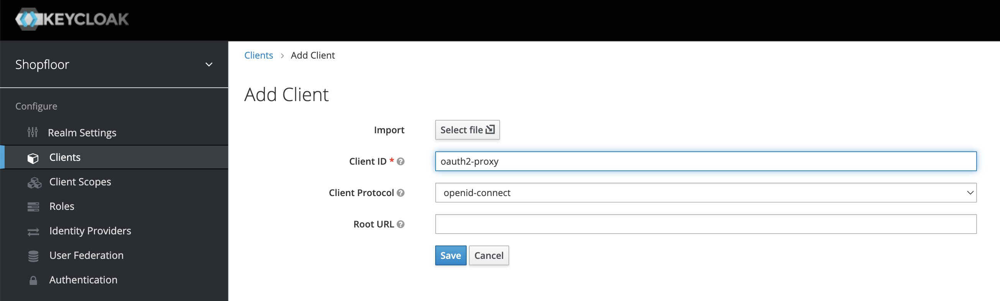

</div>

__Step 1b: Further configuration__

You're now inside the newly created client. Please select the tab "Settings" and set the following options:

 - `Access Type`: `confidential`
 - `Base URL`: `/oauth2`
 - `Redirect URL`: _depends but required_
   - This field contains the URL to which the Keycloak is allowed to redirect the user to after receiving the user to login
   - For security reasons this URL should be set very restrictive to allow only redirects to the OAuth2 Proxy of the current system
   - For example: `https://mysystem.tld/oauth2/*` or `/oauth2/*` if the OAuth2 proxy is provisioned in the system 

Finish your changes by clicking the button `Save`.

__Step 1c: Extract the client secret__

After saving in the last step a new tab has appeared: "Credentials". Navigate to this tab. Here you can find the _Client Secret_:

<div className="small-image-wrapper">

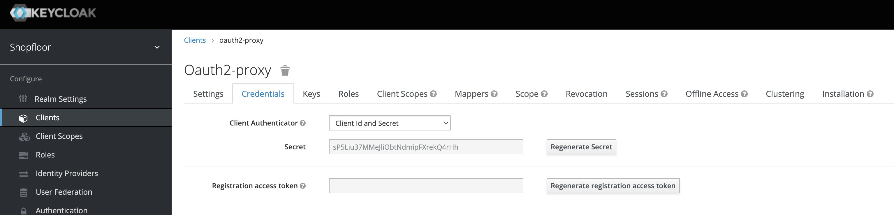

</div>

The secret here to extract is: `sP5Liu37MMeJliObtNdmipFXrekQ4rHh`. Please note down the secret we'll need it soon. The _Client ID_ oder _Client Name_ is the name of the client we created, also shown on the top. Please be careful with the casing because Keycloak expects the correct casing.

__Step 1d: Get the Well-Kown configuration address__

Select the menu point "Realm Settings" at the left main menu and copy the link of the "OpenID Endpoint Configuration" to open it in a new tab. In this example the link is: `https://demo2.shopfloor.io/auth/realms/Shopfloor/.well-known/openid-configuration` and should be similar at your side.

<div className="small-image-wrapper">

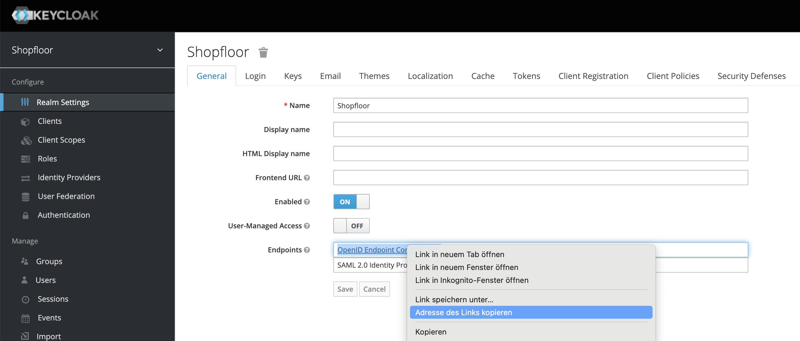

</div>

The result is a JSON from which we will need some fields in the next step.

__Step 1e: Construct the OAuth2 Proxy configuration__

With this the necessary OAuth2 Proxy configuration can be created. As prerequisites the values from the previous steps are required:

 - `Client ID`: `oauth2-proxy`
 - `Client Secret`: `sP5Liu37MMeJliObtNdmipFXrekQ4rHh`
 - `Well-Known JSON`: Fetched from `https://demo2.shopfloor.io/auth/realms/Shopfloor/.well-known/openid-configuration`

The configuration for the OAuth2 Proxy follows from that as:

  - `OAUTH2_PROXY_EMAIL_DOMAINS`: `*`
  - `OAUTH2_PROXY_HTTP_ADDRESS`: `http://0.0.0.0:8080` (on which port the OAuth2 Proxy listens)
  - `OAUTH2_PROXY_LOGIN_URL`: Field `authorization_endpoint` of `Well-Known JSON`
  - `OAUTH2_PROXY_PASS_ACCESS_TOKEN`: `true`
  - `OAUTH2_PROXY_PASS_AUTHORIZATION_HEADER`: `true`
  - `OAUTH2_PROXY_PASS_USER_HEADERS`: `true`
  - `OAUTH2_PROXY_PROFILE_URL`: Field `userinfo_endpoint` of `Well-Known JSON`
  - `OAUTH2_PROXY_PROVIDER`: `keycloak`
  - `OAUTH2_PROXY_REDEEM_URL`: Field `token_endpoint` of `Well-Known JSON`
  - `OAUTH2_PROXY_REDIRECT_URL`: `https://development.shopfloor.io/oauth2/callback`, insert the correct hostname / domain name here
  - `OAUTH2_PROXY_REVERSE_PROXY`: `true`
  - `OAUTH2_PROXY_SCOPE`: `openid profile email`
  - `OAUTH2_PROXY_SET_XAUTHREQUEST`: `true`
  - `OAUTH2_PROXY_SSL_INSECURE_SKIP_VERIFY`: `true`
  - `OAUTH2_PROXY_VALIDATE_URL`: Field `userinfo_endpoint` of `Well-Known JSON`
  - `OAUTH2_PROXY_CLIENT_ID`: `oauth2-proxy`, the name of the created client app in Keycloack
  - `OAUTH2_PROXY_CLIENT_SECRET`: `sP5Liu37MMeJliObtNdmipFXrekQ4rHh`, the secret created and noted before
  - `OAUTH2_PROXY_COOKIE_SECRET`: A new secret used by the OAuth2 Proxy to sign user tokens

_Remark:_ example values for the required fiels from the `Well-Known JSON` are:

 - `authorization_endpoint`: `https://demo2.shopfloor.io/auth/realms/Shopfloor/protocol/openid-connect/auth`
 - `userinfo_endpoint`: `https://demo2.shopfloor.io/auth/realms/Shopfloor/protocol/openid-connect/userinfo`
 - `token_endpoint`: `https://demo2.shopfloor.io/auth/realms/Shopfloor/protocol/openid-connect/token`

They are constructed following the schema: `https://DOMAIN_NAME/auth/realms/REALM_NAME/protocol/openid-connect/ENDPOINT_NAME` where `DOMAIN_NAME`, `REALM_NAME` and `ENDPOINT_NAME` are configuration values. 

__Step 1f: First configration step completed__

With this the first step has been completed and the connection between the OAuth2 Proxy and Keycloak is established and users can sign in. To fully complete the configration and ensure correct operation the next step is mandatory.

__Step 2: Configuring mappers for Shopfloor__

Inside the created client app, navigate to the tab "Mappers":

<div className="small-image-wrapper">

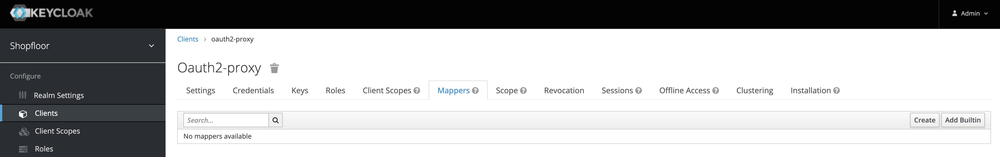

</div>

:::info

Here we need to configure modifications of the default JWT token created by Keycloak. We'll add two mappers, adding additional fields to the token, required by the Shopfloor application.

:::

__Step 2a: Create group mappers__

Click on the button "Create" and enter the following data:

 - `Name`: `groups`
 - `Mapper Type`: `Group Membership`
 - `Token Claim Name`: `groups`
 - `Full group path`: on
 - `Add to ID token`: on
 - `Add to access token`: on
 - `Add to userinfo`: on

<div className="small-image-wrapper">

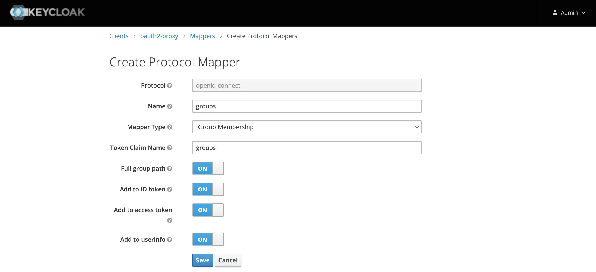

</div>

Click on "Save" to create the new mapper.

:::info

This mapper will cause the JWT token, created by Keycloak for the user, to contain a field `groups`:

```json
{
  ...
  "groups": [
    "/tenant/0bfd22e4-88c5-4f73-bcdb-6bb4ae9aa7ed",
    "/tenant/8e640e8c-12e2-4725-b16a-c6ba889c5fb1"
  ],
  ...
}
```

Shopfloor.io uses Keycloak groups for tenant separation (see [Overview](../users-tenants/overview#the-auth-layer)) so it is important to get the information to which tenants the user has access inside the JWT token.

:::

__Step 2b: Create `tenant_id` mapper__

On the mappers tab, click on the button "Create" and enter the following data:

 - `Name`: `home_tenant_id`
 - `Mapper Type`: `User Attribute`
 - `User Attribute`: `home_tenant_id`
 - `Token Claim Name`: `tenantId`
 - `Claim JSON Type`: `String`
 - `Add to ID token`: on
 - `Add to access token`: on
 - `Add to userinfo`: on
 - `Multivalued`: off
 - `Aggregate attribute values`: off
 
<div className="small-image-wrapper">

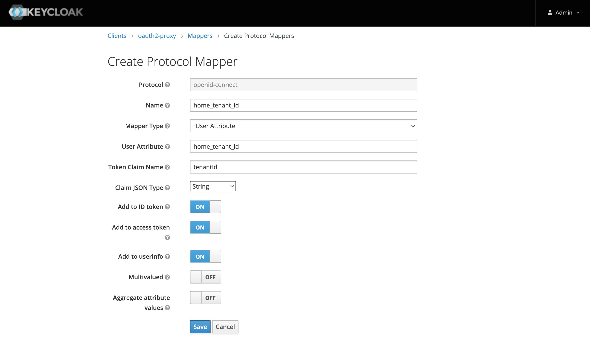

</div>

Click on "Save" to create the new mapper.

:::info

This mapper will cause the JWT token, created by Keycloak for the user, to contain a field `tenantId`:

```json
{
  ...
  "scope": "openid profile email",
  "sid": "a026080d-f619-439a-931f-d20dab389bf8",
  "email_verified": true,
  "tenantId": "0bfd22e4-88c5-4f73-bcdb-6bb4ae9aa7ed",
  "name": "elunic Admin",
  ...
}
```

Shopfloor.io uses Keycloak groups for tenant separation (see [Overview](../users-tenants/overview#the-auth-layer)). Every user is always assigned to `0 .. 1` tenants and is active in this tenant. If a user has no assigned tenant a selection screen is shown with the to the user available tenants. After selecting the user is assigned to this tenant for acces.

The field `tenantId` inside the token is __a critical__ component since it is required on every Shopfloor service call to e.g. filter data correctly to the correct tenant. The Shopfloor services extract the `tenantId` from the token in every request and filter data based on this (multi-tenant approach).

:::

__Step 3: Done__

:::success

The client for the OAuth2 Proxy has been successfully configured.

:::
