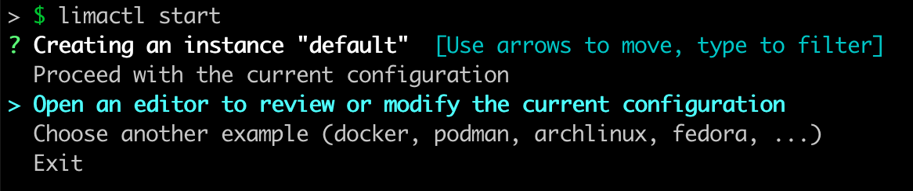
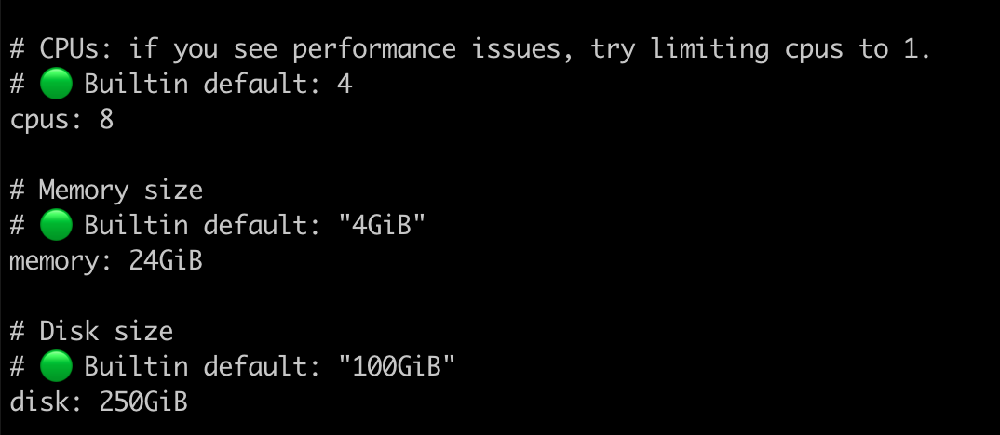
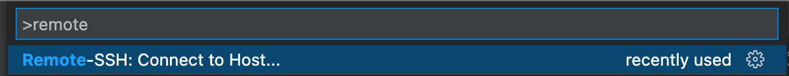
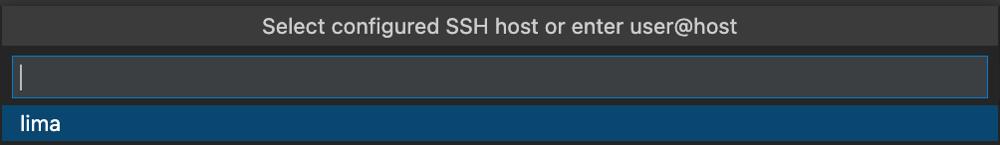

# Mac development guide

## Docker for mac issues

Unfortunately Docker for mac currently is not working well with our DEV-Setup when using the [Dockershell](https://elunic.atlassian.net/wiki/spaces/DEV/pages/1069613156/Dockershell+Quickstart). The problems are happening because of bad file sync performance when sharing files between the MacOS host filesystem and the docker filesystem, like mentioned [here](https://reece.tech/posts/osx-docker-performance/). The setup explained in this guide avoids these drawbacks by creating a virtual machine with a ubuntu linux.

## Mac usage suggestions

### LimaVM

One solution to avoid these file sharing issues is to use [LimaVM](https://github.com/lima-vm/lima#installation). We recommend installation via [Homebrew](https://brew.sh/index_de).

Please use the option to configure the VM when starting the VM the first time:


We suggest to increase CPUs, RAM and HDD space according to your machine. As you are running the whole DEV-Environment inside the VM we suggest to give most of your hardware power to the VM.


### VS Code SSH

To work within the VM like it's running on your host system you can use [VSCode SSH](https://code.visualstudio.com/docs/remote/ssh-tutorial). Go on and install the VSCode SSH extension.

Lima exposes a SSH-Connection on Port 60022. Edit your ~/.ssh/config and add the following block to your SSH-Config...

```json
cat <<EOT >> ~/.ssh/config
Host lima
  HostName 127.0.0.1
  UseKeychain yes
  AddKeysToAgent yes
  ForwardAgent yes
  StrictHostKeyChecking no
  UserKnownHostsFile /dev/null
  Port 60022
  IdentityFile ~/.ssh/<your_ssh_key>
EOT
```

You can now connect your VS Code to the Lima VM.



VS-Code Auto Port forwarding is not needed as LimaVM already exposes all ports to the host-machine. You can disable it by adding this line to VS-Code `settings.json`
`"remote.ssh.enableAgentForwarding": false`

### Setup docker, docker-compose and nvm

- Install [Docker](https://docs.docker.com/engine/install/ubuntu/)
- `sudo usermod -aG docker $USER `
- Install docker-compose
  - sudo apt install python3-pip
  - pip install docker-compose
- Install [nvm](https://github.com/nvm-sh/nvm#install--update-script)
- Install your desired node version e.g. `nvm install <node_version>`
- As long as we are using npm v6 you should downgrade your npm version `npm i -g npm@6`

You can setup your terminal, git, aliases etc. in the VM to your needs :+1:

### Running X64 images on M1 in LimaVM

Due to the overhead generated by emulating X64 architecure on an ARM M1 Mac you should prefer using multiarchitecture Docker images.

Nevertheless you can emulate X64 architecture when starting docker containers by setting the `platform`-option in your `docker-compose`-file.

```yml
your-service:
  build:
    context: ./backend/
    dockerfile: Dockerfile
  platform: linux/amd64
```

Or by setting the `--platform` arg when running a docker container.
`docker run --platform linux/amd64 hello-world`

#### Troubleshooting X64 emulation

If your X64 container starts but is not responding and displayes an error like `... exec user process caused: exec format error` in it's logs.

`qemu-user-static` and `infmt-support` might be [missing from you Linux VM](https://stackoverflow.com/a/65371609). Running `sudo apt install -y qemu-user-static binfmt-support` might fix the issue :four_leaf_clover:.


