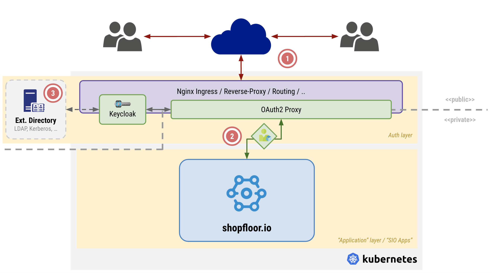

# Overview

## Overall architecture

The following schematic shows the overall structure of the Shopfloor.io application suite:

The application is split generally into two main parts:

 - _the_ **auth layer** which responsible for handling everything regarding authentication, user management. This main layer is passed by every request ensuring that every request which ends up in the application is assigned to a user, _see `2`_. 
 - _the_ **application layer** which _actually_ contains the Shopfloor.io applications, services and frontends

### The _auth layer_

The authentication layer is by design separated from the actual Shopfloor.io applications and uses off-the-shelf applications for user handling which provides security. Namely the following two ready-to-use applications are utilized:

 - [Keycloak - Open Source Identity and Access Management](https://www.keycloak.org/) as the main application for storing and handling users, groups and roles. This provides also the flexibility to connect external IdPs to a Shopfloor.io application rollout without changing any code inside the Shopfloor.io applications since they are interfacing to Keycloack as a black-box, _see `3`_. This ensures flexibility to let the Shopfloor.io applications run in different fields of application. Furthermore, the user security is provided by the Keycloak application which is an industrial standard implementation, backed by [RedHat](https://www.redhat.com/).
 - [OAuth2 Proxy](https://oauth2-proxy.github.io/oauth2-proxy/) as the proxy server to ensure that every incoming request is properly authenticated. This piece of software also enriches all internal request with the current user identity performing the request, _see `2`_.

Separating the _auth layer_ into standard software modules and using off-the-shelf applications provides the following benefits:

 - **Multi-layer flexibility** - The entire application rollout is not only flexible regarding different types of identity providers but also flexible regarding interchanging the whole _auth layer_ if required by the project
 - **Security** - The security relevant operations are provided by the used applications which utilize testing to ensure the proper functionality and security. Therefore Shopfloor.io can concentrate on application development. Security patches are also provided by the vendors of the applications and because of the fact that these applications are widely used they are more tightly monitored reagarding security and bugs than a custom login solution
 - **Documentation** - The used components come with their own documentaion which can be directly used to challange questions

### Basic request cycle

A request to a Shopfloor.io application goes thorugh the following steps:

 1. The request enters the application environment, e.g. the Kubernetes cluster, from external
 2. The internal routing mechanism forwards the request to the OAuth2 proxy application which checks if the requesting user is signed-in and has an active session. If not the user is forwarded to sign-in via Keycloak as the primary user database
    - The OAuth2 proxy uses standard OAuth flows to perform the sign-in operation via Keycloak. If required, the Keycloak application can be replaced by any other OAuth compatible IdP. This then requires minor changes inside the Shopfloor.io application if the JWT token structure created by Keycloak cannot be reproduces, because this is required inside the applications to read relevant information from it
    - But is is highly recommended to stay with the standard Shopfloor.io setup to ensure maximum compatibility to receive future Shopfloor.io updates
 3. The request between the OAuth2 proxy and the Shopfloor.io application, _see `2` inside the schematic, is then extended by Oauth2 proxy with the HTTP header `X-Auth-Request-Access-Token` which contains the JWT token created by the Keycloak during sign-in. The Oauth2 proxy enusures the validity of this token as well
 4. A backend service of Shopfloor.io then reads out the token and extracts relevant information from it:
    - user data: name, e-mail, language, ...
    - user rights
    - current user tenant
 5. The service than uses this information to process the request and respond with an answer

The services are not checking the JWT for valitiy since this is in the field of responsibility of the _auth layer_. Every services expects the header, mixed in by OAuth2 proxy, to contain a JWT token with the required fields.

### Multi-Tenancy

The Shopfloor.io application is a multi-tenancy application, meaning that every request contains the information to which tenant the current user belongs to (field `tenantId` inside the JWT token) and all services are then responsible to filter the requested data to only data which belongs to the requested tenant. Usually (simplified) this means, that every data entry has an additional field/column `tenantId` which signifies the affiliation of the data. All reading request ensure this as a filter to filter the data and all writing requests enforce that the `tenantId` of the current requesting user is mixed in with the data to be written.

In the scope of Shopfloor.io the `tenantId` is always a UUIDv4 with the defined length of 36 characters. Example: `d4c81c12-7c17-4eee-b00c-539fb4126c2b`.